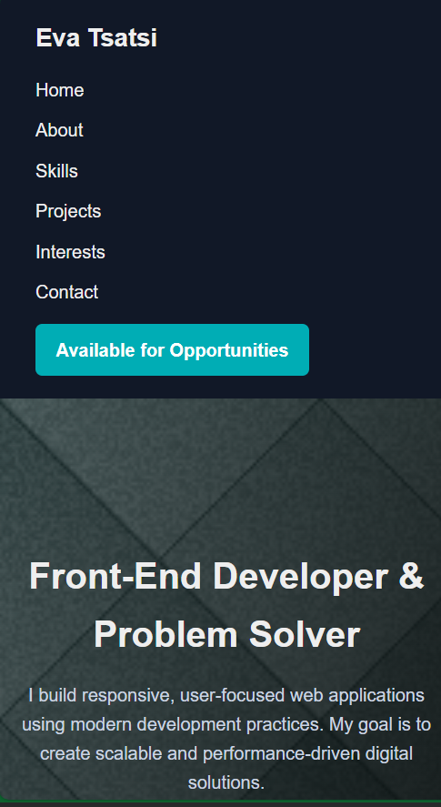
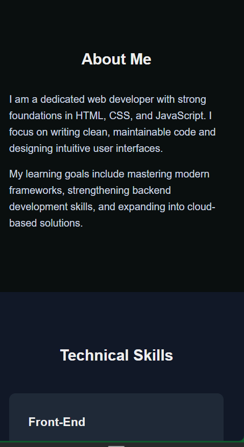
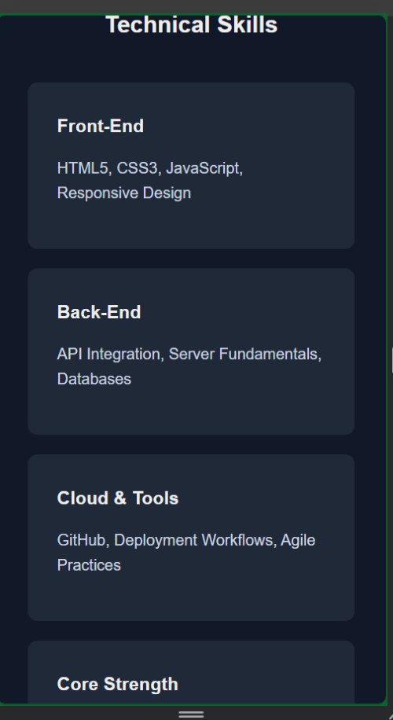
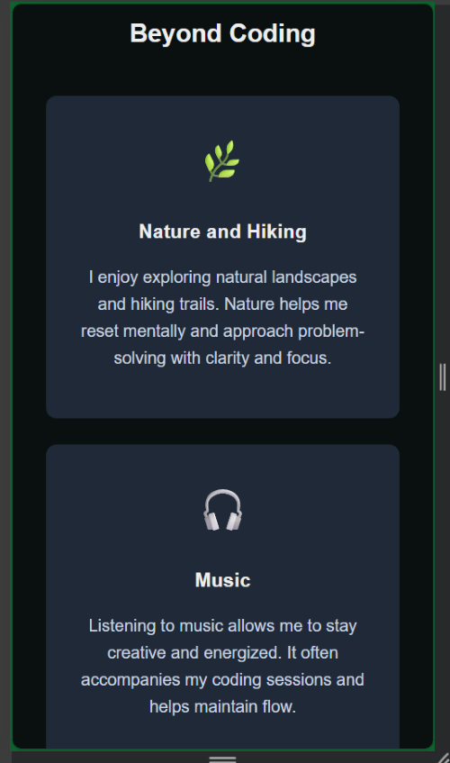
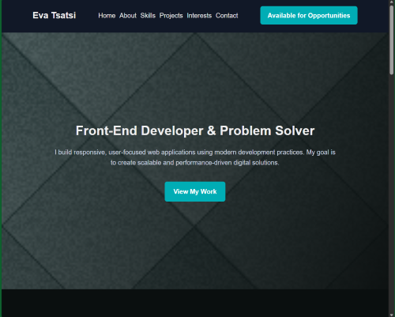
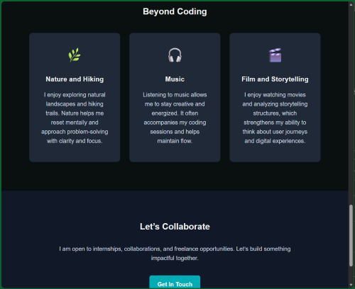
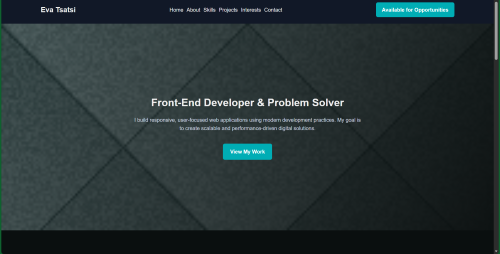
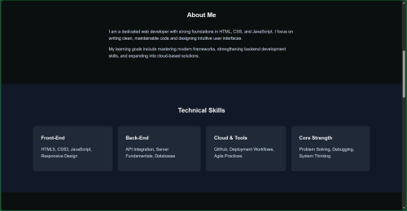

Full Name: Eva Tsatsi

 Project Overview
This project is a responsive portfolio landing page showcasing my skills, projects, and hobbies. The page demonstrates fundamental front-end development concepts including **Flexbox**, **CSS Grid**, and **media queries** for a mobile-first responsive design.

The main goal was to create a visually appealing and functional landing page that scales across **mobile**, **tablet**, and **desktop** devices, while presenting my portfolio content professionally.

---

Features Implemented

 1. Navigation (Flexbox)
- The header navigation uses **Flexbox** to arrange logo, nav links, and a call-to-action button (`Hire Me`) horizontally on larger screens and vertically on smaller screens.
- Mobile-first approach ensures that the navigation stacks naturally on smaller devices.
- Hover effects added for user interaction.

 2. Hero Section (Flexbox)
- Hero content (heading, description, and primary button) is aligned using **Flexbox**.
- Provides clear introduction with actionable button linking to projects.

 3. Skills Section (Flexbox Cards)
- Skills are presented in cards, aligned in a row on larger screens using **Flexbox** and stacked on mobile.
- Highlights front-end, back-end, cloud & tools, and problem-solving abilities.

 4. Projects Section (CSS Grid)
- Projects are displayed using **CSS Grid**.
- Grid layout changes dynamically:
  - **Mobile (≤680px)** – single column  
  - **Tablet (≥681px & ≤900px)** – two columns  
  - **Desktop (≥901px)** – three columns
- Includes project titles, descriptions, and optional images/icons.

 5. Hobbies / Interests (CSS Grid)
- Adds personality and human element to the portfolio.
- Grid layout similar to projects section for consistent responsiveness.
- Shows hobbies: Nature, Music, Film/Storytelling.

 6. Contact Call-to-Action
- Simple call-to-action button links to email.
- Aligned properly and responsive across all screen sizes.

7. Mobile-First & Media Queries
- The site was designed **mobile-first**.
- Breakpoints:
  - Tablet: 681px  
  - Desktop: 901px
- Ensures readability, proper alignment, and layout scaling.

 8. Visual Enhancements
- Color theme: dark background (#0A0F0F) with accent highlights (#00ADB5) for buttons and icons.
- Smooth hover transitions on buttons, project cards, and interest cards.
- Icons used for hobbies section to visually distinguish content.

---
9. Technologies Used
- HTML5
- CSS3 (Flexbox, Grid, Media Queries)
- Mobile-first responsive design
---

10. Learning Outcomes
- Practiced **Flexbox** for layout and alignment of header, hero, and cards.
- Applied **CSS Grid** for structured project and hobbies sections.
- Implemented responsive design for multiple breakpoints.
- Developed an aesthetically consistent dark-themed portfolio landing page.
- Added personal branding and professional content in a structured web page.

---
11. Media Versions: Mobile, Tablet and Desktop
    Screenshots

Mobile ≤680px

 Tablet 681px–900px

 

 Desktop >900px

 

  

